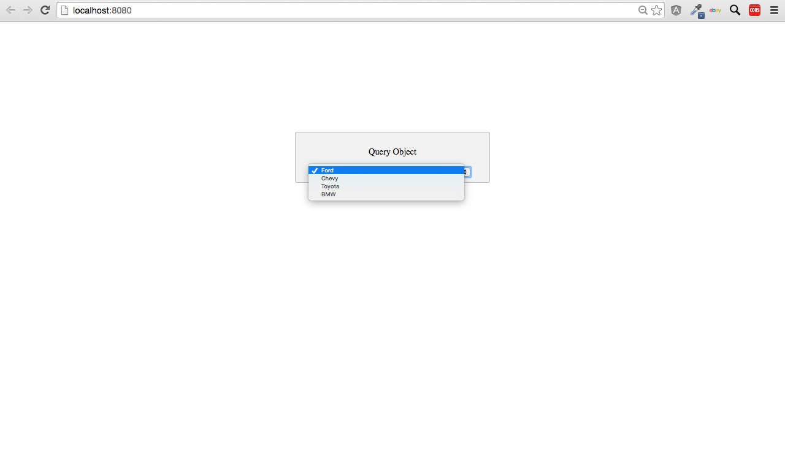

# starterTemplate-Query-Object
a Javascript starter template for running object queries using the Stamplay SDK

**CLONING: When cloning this repo, you must initialize your app first to make it work.**

 1) **Initialize the front-end of your app with Stamplay**
 <br>
- Go to your command line and enter **stamplay init**
- When prompted, enter your **appID** & **API Key**

2) **Initialize the SDK library in your app**
<br>
- In your index.html file, enter the SDK cdn script (or install with bower if you prefer)
```
<script src="//drrjhlchpvi7e.cloudfront.net/libs/stamplay-js-sdk/1.3.1/stamplay.min.js"></script>

```
```
$ bower install stamplay-js-sdk
```
- In your Javascript file, enter the initialization script at the top of the file
```
Stamplay.init('yourAppId');
```
3) **Establish query search**
- Go to your Stamplay editor and go to the **Data** section. Then go to **Objects**
- Establish which object(s) in the collection your going to query by looking at it's property **names & values**.

4) **Query Object**
```
function queryObject(){
 	var cars = document.getElementById("cars");
 	var selectedCar = cars.options[cars.selectedIndex].value;

	var objectCollection = new Stamplay.Cobject('objectModel').Collection;
	objectCollection.equalTo("property", selectedCar).fetch().then(function(res) {
		alert(objectCollection.instance[0].instance.brand);
	});
}
```


